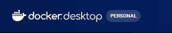
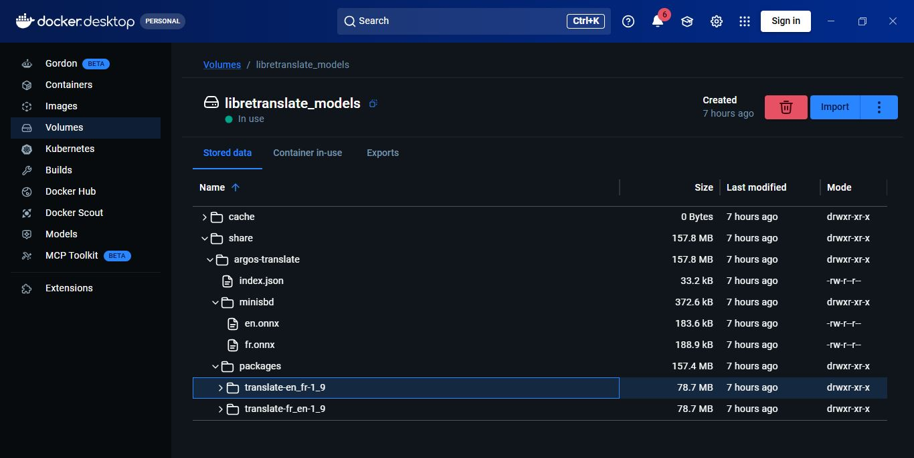
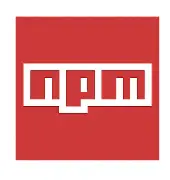
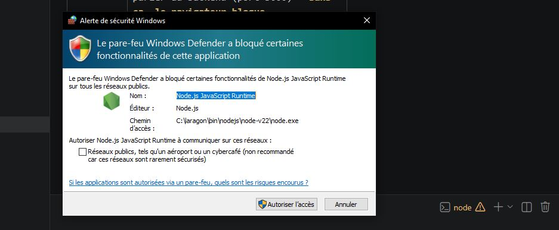

### Installation de LibreTranslate avec Docker :


 - [ ] Installer Docker desktop (Windows / Linux / Mac) et lancer le

Après cela, vérifier que docker est bien installé, utiliser dans un terminal **Powershell**<br> la commande : `docker --version`

Vous aurez un resultat similaire à ceci :
```
Docker version 29.3.1, build c2be9cc
```

 - [ ] Installer le **container** dans Docker depuis le terminal : 
`docker run -d --name libretranslate -p 5000:5000 libretranslate/libretranslate --load-only en,fr`
| Paramètre | Pourquoi |
| --- | --- |
| `-e LT_LOAD_ONLY=en,fr` | Charge uniquement des modèles anglais et français |
| `-v libretranslate_models:/home/libretranslate/.loca` | Persiste les modèles sur le disque (pas besoin de re-télécharger) |
| `-e LT_DISABLE_FILES_TRANSLATION=true` | Désactive la traduction de fichiers |
Vous aurez un resultat similaire à ceci :
```
Unable to find image 'libretranslate/libretranslate:latest' locally
latest: Pulling from libretranslate/libretranslate
0ca4ca8e967f: Pull complete 
84a2afebaf4d: Pull complete 
4f4fb700ef54: Pull complete 
4de8fa606c46: Pull complete 
281b8fe7d4f1: Pull complete 
4afda7e4a767: Pull complete 
bb97a7af1971: Pull complete 
937db3391256: Pull complete 
8e8e52f71653: Download complete 
Digest: sha256:8caf287d7b591f4dda950117f3bfc1d32053256a0c8d079630f356a2816e2e82
Status: Downloaded newer image for libretranslate/libretranslate:latest
bfc4b9d2e9ac31081b3a1b352efc8426531ed9dd215f3cb8b3a9648ee0f8243c
```

 - [ ] Voir si le container tourne : `docker ps`

Vous aurez un resultat similaire à ceci :
```
CONTAINER ID   IMAGE                           COMMAND                  CREATED          STATUS          PORTS                                         NAMES
bfc4b9d2e9ac   libretranslate/libretranslate   "./scripts/entrypoin…"   19 minutes ago   Up 19 minutes   0.0.0.0:5000->5000/tcp, [::]:5000->5000/tcp   libretranslate
```

  - [ ] Observer les logs : `docker logs -f libretranslate`

Vous aurez un resultat similaire à ceci :
```

░█░░░▀█▀░█▀▄░█▀▄░█▀▀░▀█▀░█▀▄░█▀█░█▀█░█▀▀░█░░░█▀█░▀█▀░█▀▀
░█░░░░█░░█▀▄░█▀▄░█▀▀░░█░░█▀▄░█▀█░█░█░▀▀█░█░░░█▀█░░█░░█▀▀
░▀▀▀░▀▀▀░▀▀░░▀░▀░▀▀▀░░▀░░▀░▀░▀░▀░▀░▀░▀▀▀░▀▀▀░▀░▀░░▀░░▀▀▀
v1.9.6

Booting...
/app/venv/lib/python3.11/site-packages/requests/__init__.py:109: RequestsDependencyWarning: urllib3 (2.7.0) or chardet (7.4.3)/charset_normalizer (3.4.7) doesn't match a supported version!
  warnings.warn(
Updating language models
Found 98 models
Keep 2 models
Downloading English → French (1.9) ...
Downloading French → English (1.9) ...
Downloading MiniSBD models
Downloading model: fr
Downloading model: en
Loaded support for 2 languages (2 models total)!
Power cycling...
/app/venv/lib/python3.11/site-packages/requests/__init__.py:109: RequestsDependencyWarning: urllib3 (2.7.0) or chardet (7.4.3)/charset_normalizer (3.4.7) doesn't match a supported version!
  warnings.warn(
[2026-06-17 16:15:53 +0000] [24] [INFO] Starting gunicorn 23.0.0
/app/venv/lib/python3.11/site-packages/requests/__init__.py:109: RequestsDependencyWarning: urllib3 (2.7.0) or chardet (7.4.3)/charset_normalizer (3.4.7) doesn't match a supported version!
  warnings.warn(
[2026-06-17 16:15:56 +0000] [24] [INFO] Listening at: http://[::]:5000 (24)
[2026-06-17 16:15:56 +0000] [24] [INFO] Using worker: sync
[2026-06-17 16:15:56 +0000] [29] [INFO] Booting worker with pid: 29
[2026-06-17 16:15:56 +0000] [30] [INFO] Booting worker with pid: 30
[2026-06-17 16:15:56 +0000] [31] [INFO] Booting worker with pid: 31
[2026-06-17 16:15:56 +0000] [32] [INFO] Booting worker with pid: 32
```

- [ ] Tester les routes **Url** : `curl http://localhost:5000/languages`

Vous aurez un resultat similaire à ceci :
```
StatusCode        : 200
StatusDescription : OK
Content           : [{"code":"en","name":"English","targets":["en","fr"]},{"code":"fr","name":"French
                    ","targets":["en","fr"]}]
                    
RawContent        : HTTP/1.1 200 OK
                    Connection: close
                    Access-Control-Allow-Origin: *
                    Access-Control-Allow-Headers: Authorization, Content-Type
                    Access-Control-Expose-Headers: Authorization
                    Access-Control-Allow-Method...
Forms             : {}
Headers           : {[Connection, close], [Access-Control-Allow-Origin, *], 
                    [Access-Control-Allow-Headers, Authorization, Content-Type], 
                    [Access-Control-Expose-Headers, Authorization]...}
Images            : {}
InputFields       : {}
Links             : {}
ParsedHtml        : mshtml.HTMLDocumentClass
RawContentLength  : 107
```

Ou encore via ce lien :  [Documentation (Swagger) API](http://localhost:5000/docs/)

- [ ] Voir l'espace disque des modèles : `docker exec libretranslate bash -c "du -sh /home/libretranslate/.local/share/argos-translate/packages/* | sort -rh"`

Vous aurez un resultat similaire à ceci :
```
79M     /home/libretranslate/.local/share/argos-translate/packages/translate-fr_en-1_9
79M     /home/libretranslate/.local/share/argos-translate/packages/translate-en_fr-1_9
```



- [ ] Mettre à jour **l'image** seule : `docker pull libretranslate/libretranslate:latest`


### Installer les dépendances Node.js


1. **Package npm**, aller dans le dossier backend : `cd backend`

Et entrer la commande : `npm install`<br>
Si vous tomber sur une erreur de ce type :
```
npm : Impossible de charger le fichier C:\laragon\bin\nodejs\node-v22\npm.ps1, car l’exécution de 
scripts est désactivée sur ce système. Pour plus d’informations, consultez about_Execution_Policies 
à l’adresse https://go.microsoft.com/fwlink/?LinkID=135170.
Au caractère Ligne:1 : 1
+ npm install
+ ~~~
    + CategoryInfo          : Erreur de sécurité : (:) [], PSSecurityException
    + FullyQualifiedErrorId : UnauthorizedAccess
```

...sachez que c'est juste une restriction de sécurité PowerShell : rien de bien méchant !

La solution est ***d'autoriser la commande npm dans Powershell*** grace à la commande : `Set-ExecutionPolicy -ExecutionPolicy RemoteSigned -Scope CurrentUser`

Pour vérifier l'autorisation, entrer : `Get-ExecutionPolicy` vous aurez un resultat similaire à ceci :
```
RemoteSigned
```

Après cela, refaite la commande "***npm install***" puis "***npm install -g nodemon***" <kbd>Tout en vérifiant que vous disposez d'un  fichier "package.json" au préalable</kbd> <kbd>Sans celui-ci l'installation ne peut se faire</kbd> <kbd>Si vous ne l'avez pas, créer se fichier dans le dossier "backend" </kbd> <kbd>et insérer à l'intérieur du fichier ce contenu :</kbd>
```
{
  "name": "Translate backend",
  "version": "1.0.0",
  "description": "Backend API for translation application",
  "main": "server.js",
  "scripts": {
    "start": "node server.js",
    "dev": "nodemon server.js"
  },
  "dependencies": {
    "express": "^4.18.2",
    "cors": "^2.8.5",
    "axios": "^1.6.0"
  },
  "devDependencies": {
    "nodemon": "^3.0.1"
  }
}
```

Si tous se passe bien, vous aurez un resultat similaire à ceci :
```
added 113 packages, and audited 114 packages in 42s

23 packages are looking for funding
  run `npm fund` for details

found 0 vulnerabilities
```

Ce quis s'intalle est :
   | Package   | Rôle                                                                                                 |
| --------- | ---------------------------------------------------------------------------------------------------- |
| `express` | Framework web pour créer l'API REST                                                                  |
| `cors`    | Autorise le frontend (port 3000) à parler au backend (port 3000) — **sans ça, le navigateur bloque** |
| `axios`   | Faire les requêtes HTTP vers LibreTranslate                                                          |
2. Lancer le backend : `nodemon server.js`


Si cette aleter s'affiche, ***autoriser*** l'ecoute de l'app sur le port 3000 dans tous interface réseau (publique ou privé)
  
Vous aurez un resultat similaire à ceci :
```
... http://localhost:3000
.....etc
```


### Défis liés aux bugs

1. Autorisation microphone :

Il y'a un problème classique de HTTPS vs HTTP pour les permissions microphone. Le navigateur bloque l'accès au micro sur une connexion non sécurisée (**HTTP**), sauf sur localhost.

> Règle navigateur : Le microphone nécessite soit ***localhost***, soit ***HTTPS***

02 solutions s'offrent à nous : soit utiliser `localhost` (recommandé pour le dev) au lieu de l'IP réseau et le micro fonctionnera !
u créer un `certificat HTTPS auto-signé`. Comment s'y prendre alors ?

   1. Créer un sous-dossier `certs` dans le dossier backend
   2. Créer les fichiers `key.pem` —> clé privée et `cert.pem` —> certificat
   3. Insérer un principle de chiffrement (<kbd>vous pouvez utiliser l'IA pour générer cela</kbd>)
   4. Enfin, mettre à jour le [[server.js]] pour la prise en charge de ce certificat
   5. Relancer le système avec `nodemon server.js` depuis le repertoire backend
   6. Une fois sur le site (avec comme mention "`https`"), le navigateur signale
      ***"Your connection is not private"***
      cliquer <kbd>Avancer</kbd> → <kbd>Continuer vers 192.168.XX.XX (unsafe)</kbd>
      le site s'affiche et le ` microphone fonctionne maintenant !`


### `frontend/` — Interface utilisateur
| Fichier/Dossier | Rôle |
| --- | --- |
| `index.html` | **Page principale.** Point d'entrée de l'application. Contient la structure HTML (header, textarea, boutons, onglets). |
| `about.html` | **Page "À propos".** Présente le projet, son but, les technologies utilisées, ou l'équipe et les avis utilisateurs. |
| `admin.html` | **Page d'administration.** Interface pour l'admin (gestion utilisateurs, stats globales, modération, etc.). |
| `404.html` | **Page d'erreur.** Affichée quand l'utilisateur accède à une URL inexistante. |
| `icon1.png` / `icon2.png` | **Icônes.** logos utilisés dans l'interface ou au niveau de l'onglet navigateur. |
| `css/style.css` | **Styles personnalisés.** Définit le thème, animations, responsive et positionnement des éléments. |
| `assets/css/` *(all.css, w3.css, fontawesome.css, etc.)* | **Bibliothèques CSS.** Font Awesome (icônes), W3.CSS (framework CSS), et leurs variantes minifiées/shims. |
| `assets/webfonts/` *(fa-*.woff2)* | **Polices d'icônes Font Awesome.** Fichiers de police nécessaires pour afficher les icônes. |
| `js/app.js` | **Cœur de l'application frontend.** Gère : génération ID utilisateur, traduction, historique, favoris, stats, auto-complétion, voice-to-text, onglets, notifications toast. |
| `js/voiceService.js` | **Service de reconnaissance vocale.** Utilise l'API Web Speech du navigateur pour la parole → texte (français). |
| `js/chart.js` | **Graphiques et visualisations.** Affiche les statistiques (camembert, histogrammes) sur les traductions, langues utilisées, etc. |

### `backend/` — Serveur API
| Fichier/Dossier | Rôle |
| --- | --- |
| `server.js` | **Point d'entrée du serveur.** Configure Express, HTTPS, CORS, sert les fichiers frontend, écoute sur le port 80/443. |
| `package.json` | **Dépendances.** Liste express, cors, axios, nodemon + scripts de démarrage. |
| `package-lock.json` | **Verrouillage des versions.** Versions exactes des dépendances installées. |

#### `backend/certs/`
| Fichier | Rôle |
|---------|------|
| `key.pem` | **Clé privée SSL/TLS.** Permet le HTTPS (connexion sécurisée). |
| `cert.pem` | **Certificat SSL auto-signé.** Le navigateur le vérifie pour établir le HTTPS. |

#### `backend/controllers/`
| Fichier | Rôle |
|---------|------|
| `translateController.js` | **Orchestrateur.** Reçoit les requêtes HTTP, appelle les services, renvoie les réponses JSON. |

#### `backend/routes/`
| Fichier | Rôle |
|---------|------|
| `translate.js` | **Définition des endpoints API.** `POST /translate`, `GET /history`, `GET /favorites`, `GET /stats`, `GET /suggest-phrase`, `GET /predict`. Route vers le contrôleur. |

#### `backend/services/`
| Fichier | Rôle |
|---------|------|
| `libreTranslateService.js` | **Service de traduction.** Appelle l'API LibreTranslate (Docker port 5000) pour traduire le texte. |
| `autoCompleteService.js` | **Auto-complétion.** Génère suggestions basées sur l'historique global (bigrams, fréquences). |

#### `backend/database/`
| Fichier | Rôle |
|---------|------|
| `db.js` | **Gestionnaire de base de données JSON.** Crée, lit, écrit dans les fichiers `.json`. Gère la persistance des données. |
| `translations.json` | **Données de traduction.** Stocke l'historique des traductions (texte source, texte traduit, langues, timestamps, ID utilisateur). |
| `admin.json` | **Données admin.** Stocke les comptes admin, logs d'administration, ou paramètres de modération. |
| `notifications.json` | **Notifications.** Stocke les messages système, alertes, ou notifications à afficher aux utilisateurs. |
| `sayto.json` | **Messages "SayTo".** Probablement stockage des messages/interactions utilisateur-à-utilisateur ou fonctionnalité "dire à quelqu'un". |
